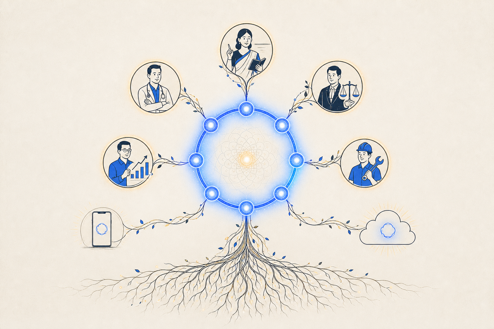
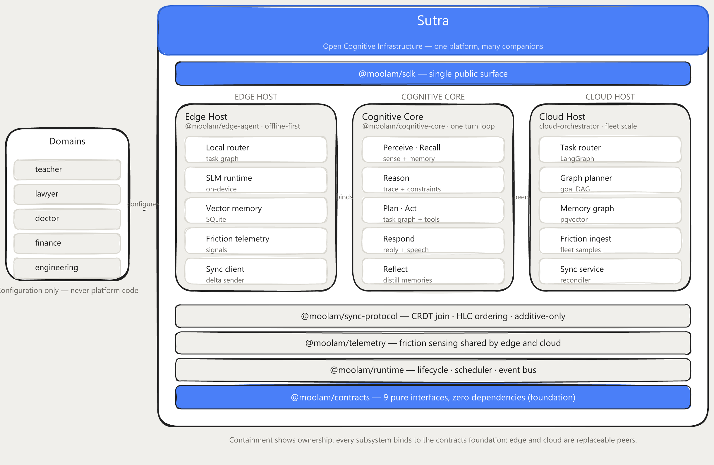
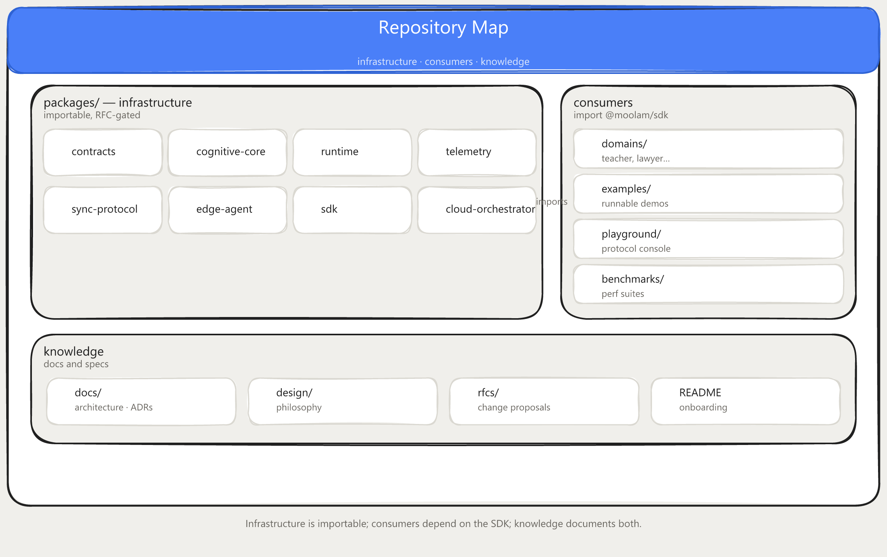
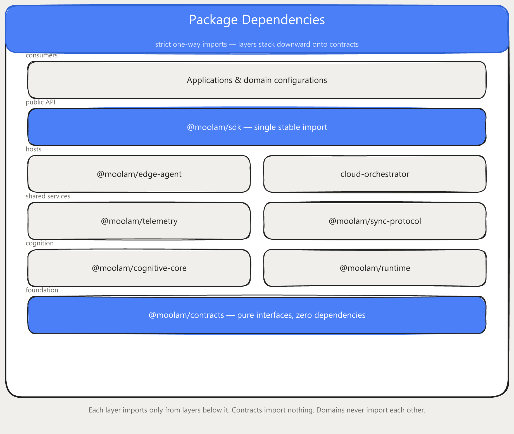
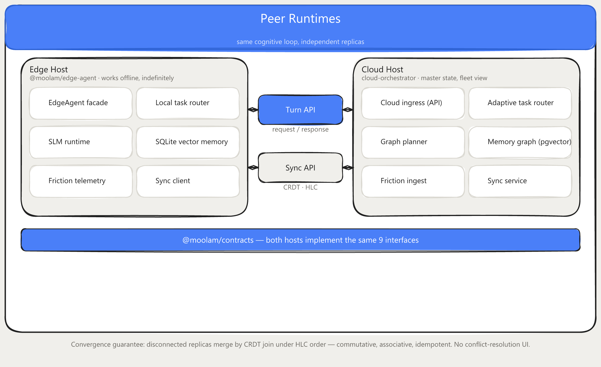
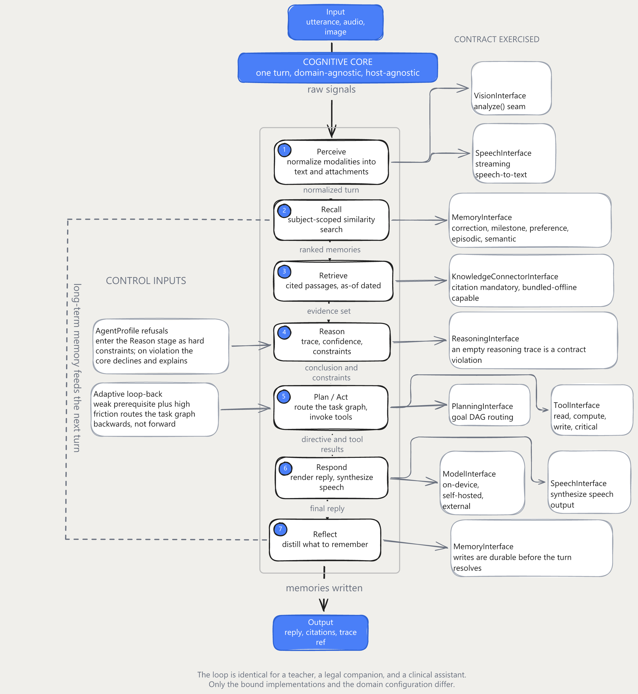
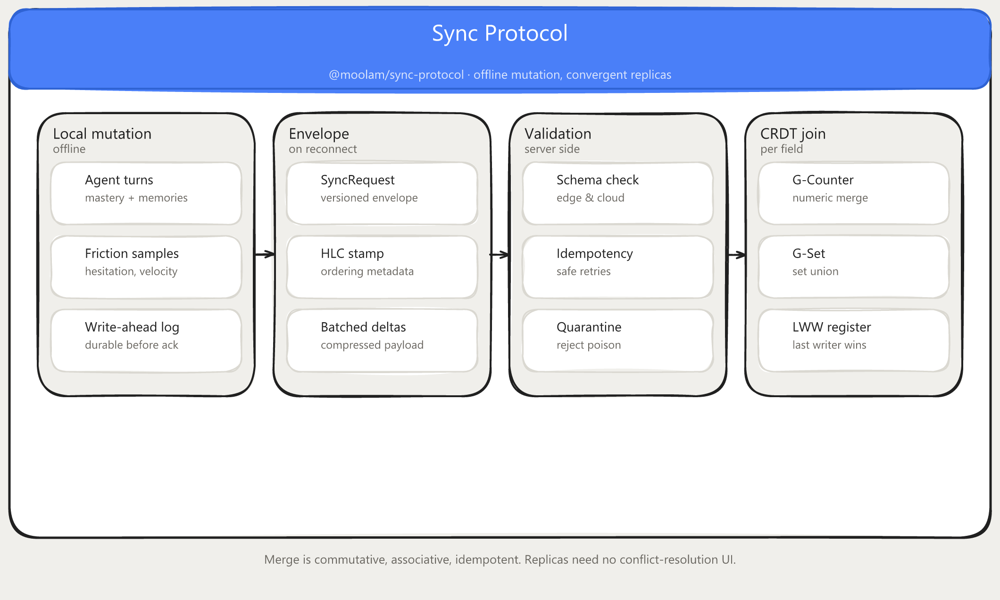
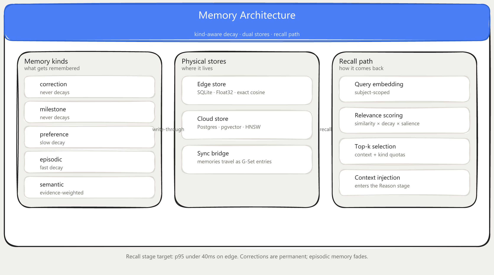
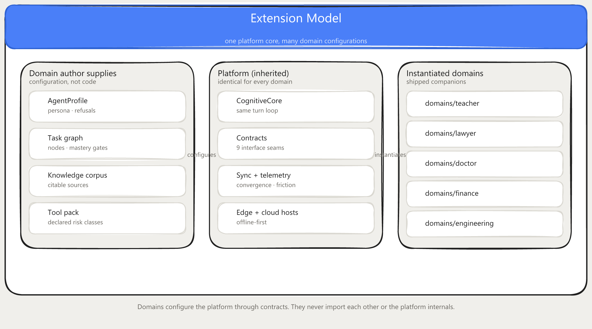
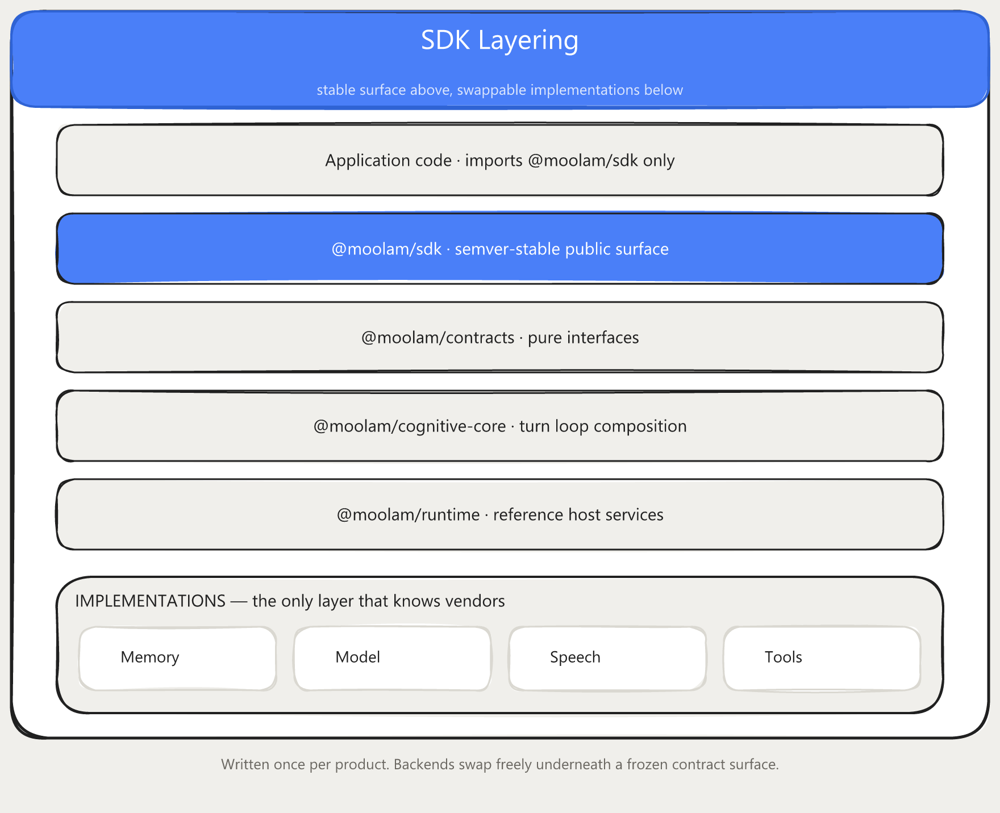

<div align="center">



# Sutra

### Indian Sovereign AI Initiative for Open Autonomous Cognitive Companion

</div>

---

## What is Sutra?

Machine cognition today is rented. It lives on someone else's servers, behind someone else's API, and it stops the moment the network does. For a companion meant to teach a child, support a patient, or reason over a case file, that arrangement is untenable. The intelligence must run where the person is, on hardware they control, over data that never has to leave their hands.

Sutra is the infrastructure for that: an open, sovereign, domain-agnostic foundation for autonomous cognitive companions. Underneath every companion is a single agent loop (perceive, recall, reason, plan, act, respond, reflect) expressed against pure contracts. Give it a teaching configuration and it becomes a tutor; give it a legal, clinical, or financial one and it becomes that instead. The loop never changes between domains. Only the configuration does, and that is the entire point.

Its two commitments are architectural, not aspirational:

- **Sovereignty.** Every turn can execute on-device, against a local model and a local memory, with no dependence on connectivity or any external service. This is offline-first without an asterisk: full turns run with no network, for as long as needed, and data residency is a property of the design rather than a deployment option.
- **Convergence without loss.** Edge and cloud are peers, not client and server. Replicas act independently while disconnected and reconcile through CRDT merge under a Hybrid Logical Clock: commutative, associative, idempotent. Nothing done offline is ever discarded, and no conflict-resolution interface exists, because none is needed.

The cognitive primitives (memory, planning, reasoning, reflection, speech, vision, tools) are declared as interfaces in `@moolam/contracts`, never as fixed implementations. Integrators supply the bindings and a domain specification; the cognitive loop, the synchronization protocol, the audit trail, and the multimodal surfaces are all inherited.

This is early-stage infrastructure, and it states its stage plainly: the contracts and both reference hosts build and run today, while much remains scaffold and the interfaces will still move under the [roadmap](docs/ROADMAP.md). It is developed in the open by [Moolam AI](https://github.com/moolamai) under Apache-2.0, as sovereign cognitive infrastructure that any institution or builder can stand on.

---

## What lives here

| Layer | Location | Role |
|---|---|---|
| Contracts | `packages/contracts` | Pure interfaces: Memory, Model, Reasoning, Speech, Vision, Tool, Planning, Knowledge, Runtime. Zero dependencies |
| Cognitive Core | `packages/cognitive-core` | `CognitiveCore`: the agent loop composed from one binding per contract |
| Runtime | `packages/runtime` | Reference lifecycle host, scheduler, event bus; the seam edge and cloud share |
| Protocol | `packages/sync-protocol` | The wire contract (Zod-validated) + CRDT merge engine. Framework-agnostic; the centre of gravity |
| Telemetry | `packages/telemetry` | Friction sensing (hesitation, velocity, revision churn) shared by edge and cloud |
| Edge host | `packages/edge-agent` | Offline-first on-device runtime: local SLMs, SQLite vector memory, autonomous sync |
| Cloud host | `packages/cloud-orchestrator` | Python reference engine: FastAPI + LangGraph task router, planner, memory graph, sync service |
| SDK | `packages/sdk` | One public entry point: `import { CognitiveCore } from "@moolam/sdk"` |
| Domains | `domains/` | Domain specifications (teacher, lawyer, doctor, engineering, finance). Configuration, never platform code |
| Examples | `examples/` | Nine small runnable scripts against the SDK |
| Benchmarks | `benchmarks/` | Merge throughput, memory retrieval, sync round-trip, core loop overhead |
| Playground | `playground/` | Interactive protocol console driving the production packages |
| Docs | `docs/` | Layered documentation, ADRs, PRD matrix; `design/` and `rfcs/` at the root |

## Architecture

Sutra is **protocol-first**. The edge and the cloud are peers decoupled by a strict, framework-agnostic contract; any backend that speaks the contract can replace ours. Both hosts run the same cognitive loop. Offline is not a degraded mode: replicas act independently and converge through CRDT merge (commutative, associative, idempotent) under Hybrid Logical Clock ordering.

Canonical architecture maps, reader-friendly views of how Sutra fits together:

### Platform at a glance



The whole system in one frame: domains configure the platform through `@moolam/sdk`; edge and cloud are replaceable peers over the cognitive core; everything binds to the `@moolam/contracts` foundation with sync, telemetry, and runtime as cross-cutting layers.

### Repository map

Where everything lives: infrastructure packages, consumers, and knowledge.



### Package dependencies

Layers stack downward onto contracts; imports are strict and one-way, so infrastructure never depends on domains, and domains never import each other.



### Edge and cloud (peers)

Two replaceable peer hosts sharing the same contracts, joined by the Turn API and Sync API seams.



### Cognitive execution pipeline

One turn through the core: perceive → recall → retrieve → reason → plan/act → respond → reflect, with the contracts each stage exercises.



### Synchronization protocol

Offline mutation to convergent replicas in four stages: local mutation, envelope, validation, CRDT join.



### Memory architecture

Kind-aware decay, dual edge/cloud stores, and the recall path back into reasoning.



### Domain extension

One platform core, many domain configurations: authors supply config; the platform is inherited.



### SDK layering

A stable public surface above swappable implementations; only the bottom layer knows vendors.



## Core subsystems

- **CAST** - Cognitive Assessment & State Tracking. Friction-first telemetry folded into a Bayesian mastery posterior per concept node.
- **ATR** - Adaptive Task Router. A LangGraph `StateGraph` with *cyclical* edges: friction on a concept routes back through its prerequisite subgraph, not forward.
- **MCE** - Memory & Context Engine. Kind-tagged long-term memory (corrections never decay) in pgvector, mirrored on-device in SQLite.
- **SYNC** - Protocol-first state reconciliation. Deterministic CRDT merge on reconnect. No lost evidence, ever.
- **CK** - Cognitive Contracts. The nine interfaces everything above is built from, replaceable piece by piece.

Formal spec: [`docs/PRD_MATRIX.md`](docs/PRD_MATRIX.md). Decision history: [`docs/adr/`](docs/adr/README.md). Implementation philosophy: [`design/`](design/README.md).

## Quickstart

```bash
# Prerequisites: Node >= 22, pnpm >= 10, Python >= 3.12, Docker

pnpm install
pnpm build

# Run the examples (offline, no keys needed)
pnpm --filter @moolam/examples run teacher-basic
pnpm --filter @moolam/examples run cloud-sync

# Cloud host (reference engine)
pnpm infra:up              # pgvector + redis + orchestrator
# or run the orchestrator directly:
cd packages/cloud-orchestrator && pip install -e . && uvicorn sutra_orchestrator.main:app --reload

# Playground console
pnpm --filter @moolam/playground dev   # http://localhost:3000
```

## Who is this for?

| You are… | What Sutra gives you | Where to start |
|---|---|---|
| **App developer / founder** | The entire cognition layer for a companion product: offline on-device turns, long-term memory, prerequisite-aware routing, conflict-free sync | Run `examples/`, open the Playground, read [`docs/sdk/`](docs/sdk/README.md), pick your domain in [`domains/`](domains/README.md) |
| **Domain professional / researcher** | Inspectable machine assistance: auditable reasoning traces, cited knowledge, risk-classed tools, refusal boundaries as configuration | [`docs/PRD_MATRIX.md`](docs/PRD_MATRIX.md), then your profession's spec under `domains/` |
| **Open-source contributor** | A protocol-first codebase where the contracts are the centre of gravity | [`CONTRIBUTING.md`](CONTRIBUTING.md), then [`docs/ROADMAP.md`](docs/ROADMAP.md) for stage criteria and open areas |
| **Curious learner** | The Playground console is a glass-box demo of how a cognitive companion "thinks" | `pnpm --filter @moolam/playground dev` and play a subject |

**Development stages:** Stage 0 (protocol & contracts scaffold - current) → Stage 1 (hardening & cross-language conformance) → Stage 2 (native edge runtimes & pilots) → Stage 3 (frozen 1.0 contracts & ecosystem). Full criteria in [`docs/ROADMAP.md`](docs/ROADMAP.md).

## Repository layout

See the [repository map](#repository-map) above for the conceptual layout. Package paths:

| Path | Contents |
|---|---|
| `packages/contracts` | Pure cognitive + runtime interfaces |
| `packages/cognitive-core` | `CognitiveCore` composition loop |
| `packages/runtime` | Lifecycle host, scheduler, event bus |
| `packages/sync-protocol` | Wire contract + CRDT resolver |
| `packages/telemetry` | Friction collector |
| `packages/edge-agent` | Offline-first on-device host |
| `packages/cloud-orchestrator` | FastAPI + LangGraph reference engine |
| `packages/sdk` | Public entry point |
| `domains/` | Domain specifications (teacher, lawyer, doctor, engineering, finance) |
| `examples/` | Nine runnable SDK examples |
| `benchmarks/` | Microbenchmarks |
| `playground/` | Protocol console |
| `docs/` | Layered docs, ADRs, diagrams |
| `design/` | Implementation philosophy |
| `rfcs/` | RFC process + template |
| `infra/` | Docker Compose + schema |

## Contributing and community

Sutra is built in the open and grows through its community: engineers, ML practitioners, domain experts (law, medicine, finance, engineering, agriculture), educators, linguists, writers, and designers all have first-class contribution paths. Domain configurations - task graphs, knowledge connectors, tool packs, agent profiles - are as valuable as platform code.

| Document | What it covers |
|---|---|
| [`CONTRIBUTING.md`](CONTRIBUTING.md) | Ways to be part of the initiative, dev setup, workflow, coding and testing standards, the RFC process, domain configurations, localization |
| [`GOVERNANCE.md`](GOVERNANCE.md) | How decisions are made: roles, lazy consensus, RFC gating, release policy |
| [`CODE_OF_CONDUCT.md`](CODE_OF_CONDUCT.md) | Community standards and enforcement (Contributor Covenant 2.1) |
| [`SECURITY.md`](SECURITY.md) | Private vulnerability reporting, disclosure timelines, scope |
| [`.github/SUPPORT.md`](.github/SUPPORT.md) | Which channel to use for what |

Quick start for contributors: fork, `pnpm install && pnpm build && pnpm typecheck`, pick a `good first issue`, and open a PR with signed-off commits (`git commit -s`). Changes to the wire contract or the cognitive contracts go through the RFC process (`rfcs/`) first; everything else follows the normal review flow.

## License

Apache-2.0 © Moolam AI
